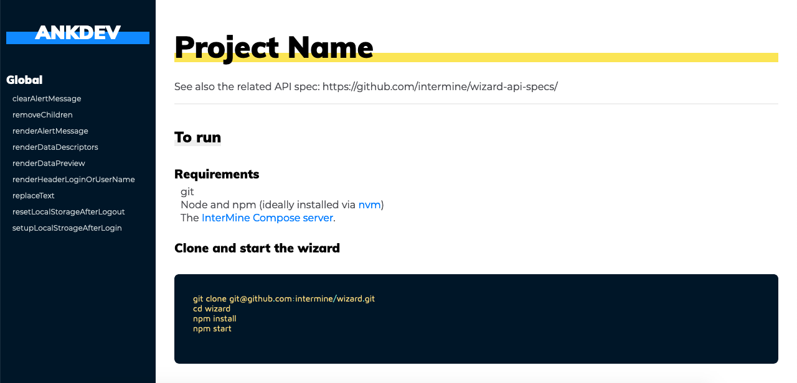

# clean-jsdoc-theme
A clean, responsive template / theme for JSDoc 3. This is created for those who love design.
### Demo screen



## Install
> Note you must have `npm` installed on your machine.

On your command line type
```bash
npm install clean-jsdoc-theme
```

## Usage
Clone repository to your designated jsdoc template directory, then

```bash
jsdoc entry-file.js -t path/to/clean-jsdoc-theme
```

## Node.js Dependency
In your projects package.json file add a generate script
```json
"script": {
  "generate-docs": "node_modules/.bin/jsdoc --configure .jsdoc.json --verbose"
}
```

In your `jsdoc.json` file, add a template option.

```json
"opts": {
  "template": "node_modules/clean-jsdoc-theme"
}
```


## Example JSDoc Config
```json
{
    "source": {
        "include": ["lib", "package.json", "README.md"],
        "includePattern": ".js$",
        "excludePattern": "(node_modules/|docs)"
    },

    "plugins": [
        "plugins/markdown"
    ],

    "opts": {
        "encoding": "utf8",
        "readme": "./README.md",
        "destination": "docs/",
        "recurse": true,
        "verbose": true,
        "template": "./node_modules/clean-jsdoc-theme"
    }
}
```

## Features
You can pass an object called `theme_opts` under `opts` for more options like:
```javascript
"opts":{
  /*
    Default options
  */
  "theme_opts":{
    "navbar_title": "Navbar Title", 
    /* 
      Instead of only string you can pass html element like 
      Path must be absolute not relative to this config file.
    */

    "footer": "This is footer",   // Here again you can pass html element 
  }
}
```

## License
Licensed under the MIT license.