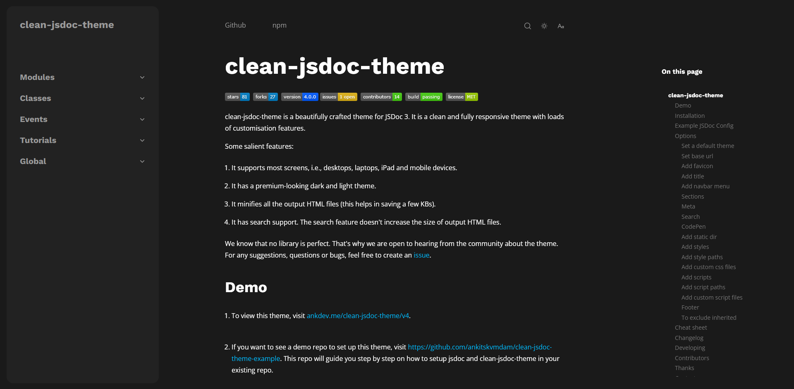
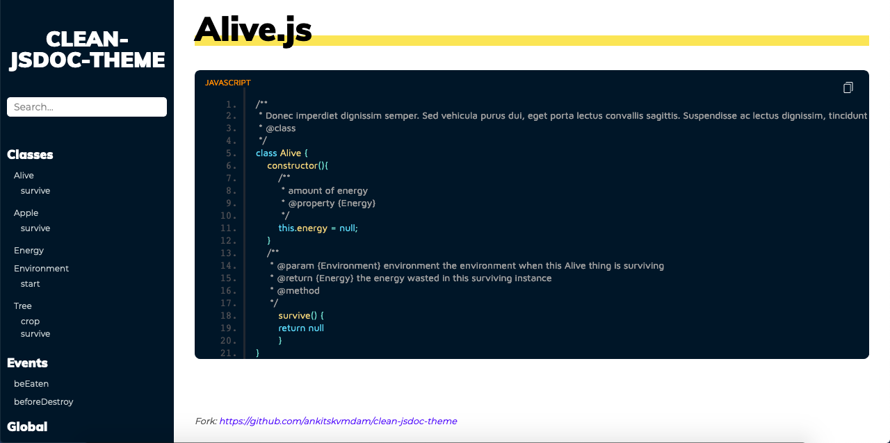
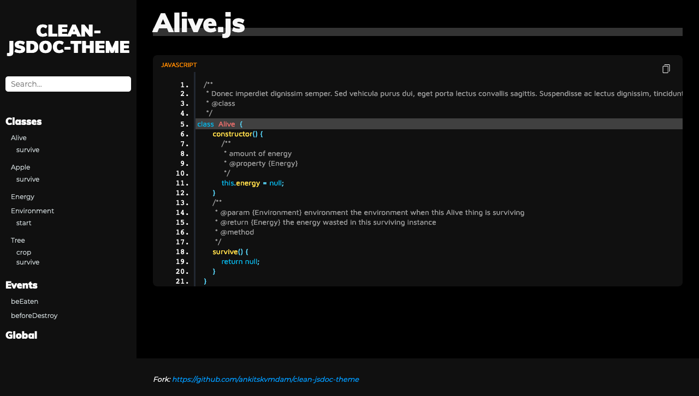
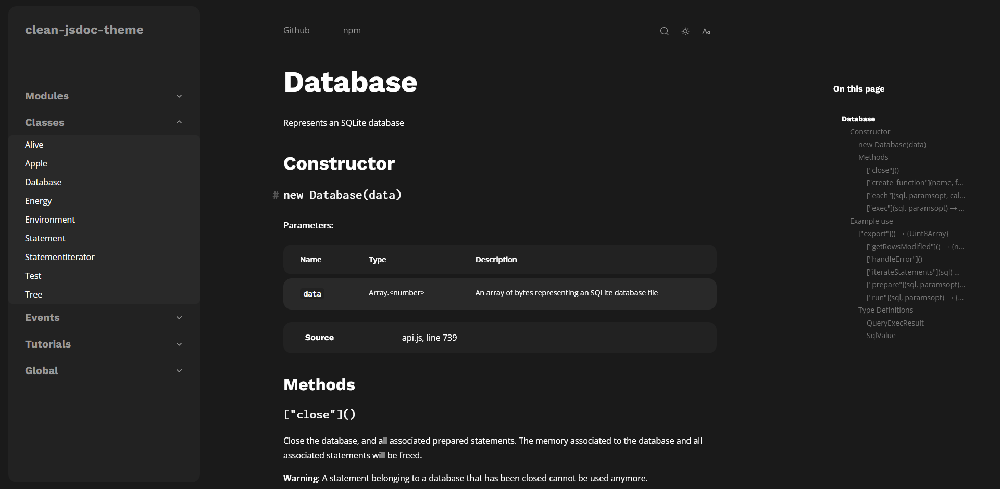
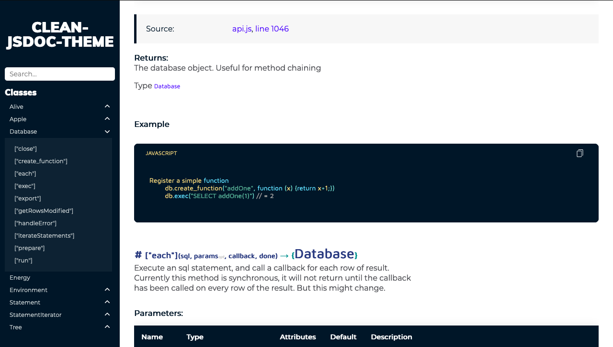

# clean-jsdoc-theme

[](https://github.com/ankitskvmdam/clean-jsdoc-theme) [](https://github.com/ankitskvmdam/clean-jsdoc-theme/fork)  [](https://github.com/ankitskvmdam/clean-jsdoc-theme/issues) [](https://github.com/ankitskvmdam/clean-jsdoc-theme/issues?q=is%3Aissue+is%3Aclosed) [](https://github.com/ankitskvmdam/clean-jsdoc-theme/graphs/contributors) [](https://www.npmjs.com/package/clean-jsdoc-theme) [](https://travis-ci.org/ankitskvmdam/clean-jsdoc-theme) [](https://github.com/ankitskvmdam/clean-jsdoc-theme/blob/master/LICENSE) [](https://ankdev.me/clean-jsdoc-theme/index.html) [](https://github.com/ankitskvmdam/clean-jsdoc-theme/blob/master/CODE_OF_CONDUCT_HINDI.md) [](https://github.com/ankitskvmdam/clean-jsdoc-theme/blob/master/CODE_OF_CONDUCT.md)
<br>
A beautifully crafted theme/template for JSDoc 3. This theme/template looks and feels like a premium theme/template. This is a fully mobile responsive theme and also highly customizable theme (for more look below in <a href="#features">feature section</a>).<br>

Feel free to raise <a href="https://github.com/ankitskvmdam/clean-jsdoc-theme/issues">issues</a>.

### Table of content

-   [Demo](#demo)
    -   [Screenshot](#screenshot)
-   [Technologies Used](#technologies-used)
-   [Motivation](#motivation)
-   [Install](#install)
-   [Usage](#usage)
-   [Nodejs Dependencies](#nodejs-dependency)
-   [Example Jsdoc Config](#example-jsdoc-config)
-   [Features](#features)
    -   [theme](#theme--light--dark)
    -   [title](#title-string--html)
    -   [filter](#filter-boolean)
    -   [menu](#menu-array)
    -   [meta](#meta-array)
    -   [search](#search-)
    -   [overlay_scrollbar](#overlay_scrollbar-)
    -   [create_style](#create_style-string)
    -   [add_scripts](#add_scripts-string)
    -   [add_style_path](#add_style_path-array)
    -   [add_script_path](#add_script_path-array)
    -   [footer](#footer-string--html)
    -   [static_dir](#static_dir-arraystring)
    -   [include_css](#include_css-arraystring)
    -   [include_js](#include_js-arraystring)
    -   [Example](#example-theme_opts)
    -   [Cheat sheet](#cheat-sheet)
-   [Changelog](#changelog)
-   [Developing](#developing)
-   [Contributors](#contributors)
-   [Contact](#contact)
-   [License](#license)

## Demo

Live demo (dark): <a href="https://ankdev.me/clean-jsdoc-theme/dark/index.html">https://ankdev.me/clean-jsdoc-theme/dark/index.html</a> <br>
Live demo (light): <a href="https://ankdev.me/clean-jsdoc-theme/light/index.html">https://ankdev.me/clean-jsdoc-theme/light/index.html</a>

#### Screenshot








## Technologies Used

1. Fuse.js - Fuse.js is a powerful, lightweight fuzzy-search library, with zero dependencies. [Learn More](https://fusejs.io/)
1. Overlay Scrollbars - A javascript scrollbar plugin which hides native scrollbars, provides
   custom styleable overlay scrollbars and keeps the native functionality and feeling. [Learn More](https://kingsora.github.io/OverlayScrollbars/#!overview)
1. Nodejs

## Motivation

At the time when I was new to js documentation and jsdoc, it was hard for me to find any theme for jsdoc which is highly customizable or regularly maintaining. Also, the search used in other themes is not that advanced.
To tackle these I created this project. I am actively listening to the community and try to make the changes as soon as possible.

## Install

> Note you must have `npm` installed on your machine.

On your command line type

```bash
npm install clean-jsdoc-theme
```

## Usage

Clone repository to your designated jsdoc template directory, then

```bash
jsdoc entry-file.js -t path/to/clean-jsdoc-theme
```

## Node.js Dependency

In your projects package.json file add a generate script

```json
"script": {
  "generate-docs": "node_modules/.bin/jsdoc --configure .jsdoc.json --verbose"
}
```

In your `jsdoc.json` file, add a template option.

```json
"opts": {
  "template": "node_modules/clean-jsdoc-theme"
}
```

## Example JSDoc Config

```json
{
    "source": {
        "include": ["lib", "package.json", "README.md"],
        "includePattern": ".js$",
        "excludePattern": "(node_modules/|docs)"
    },

    "plugins": ["plugins/markdown"],

    "opts": {
        "encoding": "utf8",
        "readme": "./README.md",
        "destination": "docs/",
        "recurse": true,
        "verbose": true,
        "template": "./node_modules/clean-jsdoc-theme",
        "theme_opts": {
            "theme": "dark"
        }
    }
}
```

## Features

You can pass an object called `theme_opts` under `opts` for more options.

### `theme : "light" | "dark"`

To set the overall theme of the documentation file(s). Currently there is only two variant `"light"` and `"dark"` but in future I will try to add more.
`Default value is "light"`

### `title: string | HTML`

To set the title to the navbar. String and HTMl is both accepted. Use HTML to overwrite the default HTML. You can do something like this

```json
 "title": ""
```

You can use `static_dir` to copy all you static files to output dir and use that path in place of `path/to/img`. For more details look `static_dir` section.

### `filter: boolean`

This is deprecated. This is used to turn the navbar image to white for better contrast.

### `menu: Array<{}>`

To render extra link(s) in navbar. It accepts an array of objects example:

```json
"menu" : [
  {
    "title": "Website",
    "link": "https://ankdev.me/clean-jsdoc-theme/dark/",
    "target": "_blank",
    "class": "some-class",
    "id": "some-id"
  }
]
```

#### Required properties

| name    | type     |
| ------- | -------- |
| `title` | `string` |
| `link`  | `string` |

#### Optional Properties

| name     | type     |
| -------- | -------- |
| `target` | `string` |
| `class`  | `string` |
| `id`     | `string` |

### `meta: Array<{}>`

A list of `meta` tag attributes to add to the `head` of each page.

```json
"meta" : [
  {
    "name": "author",
    "content": "Ankit Kumar"
  },
  {
    "name": "description",
    "content": "Best Clean and minimal JSDoc 3 Template/Theme"
  }
]
```

#### Properties

Any valid combination of [HTML metadata attributes](https://developer.mozilla.org/en-US/docs/Web/HTML/Element/meta#Attributes).

### `search: {}`

To render search. Default value:

```json
"search": {
  "shouldSort": true,
  "threshold": 0.4,
  "location": 0,
  "distance": 100,
  "maxPatternLength": 32,
  "minMatchCharLength": 1,
}
```

#### Properties

Any valid [fuse.js properties](https://fusejs.io/api/options.html)

### `overlay_scrollbar: {}`

Includes the OverlayScrollbars plugin. Simply passing an empty object will activate this feature.

```json
"overlay_scrollbar": {
  "option": {}
}
```

#### Properties

Any valid [overlay scrollbar properties](https://kingsora.github.io/OverlayScrollbars/#!documentation/options)

### `create_style: string`

To create custom style rules. Example:

```json
"create_style": "nav{background: yellow} footer {background: green}"
```

Here the nav and footer style rule is to attached to the HTML's `style` tag.

### `add_scripts: string`

To create custom scripts. Example:

```json
"create_style": "function foo(){console.log('foo')} function bar() {console.log('bar')}"
```

Here the script is to attached to the HTML's `script` tag.

### `add_style_path: Array<{}>`

Use this option to add third party css library.

> Note: You have to pass an array of object, and object keys are actually the attributes which you want in you link tag.

Example:

```json
"add_style_path": [
  {
    "href": "https://cdn.jsdelivr.net/npm/bootstrap@5.0.0-beta1/dist/css/bootstrap.min.css",
    "integrity": "sha384-giJF6kkoqNQ00vy+HMDP7azOuL0xtbfIcaT9wjKHr8RbDVddVHyTfAAsrekwKmP1",
    "crossorigin": "anonymous"
  }
],
```

#### Properties

Any valid [style tag attributes](https://developer.mozilla.org/en-US/docs/Web/HTML/Element/style)

### `add_script_path: Array<{}>`

Use this option to add third party js library.

> Note: You have to pass an array of object, and object keys are actually the attributes which you want in you script tag.

Example:

```json
"add_script_path": [
  {
    "href": "https://code.jquery.com/jquery-3.5.1.js",
    "integrity": "sha256-QWo7LDvxbWT2tbbQ97B53yJnYU3WhH/C8ycbRAkjPDc=",
    "crossorigin": "anonymous"
  }
],
```

### Properties

Any valid [script tag attributes](https://developer.mozilla.org/en-US/docs/Web/HTML/Element/script)

### `footer: string | HTML`

Thing which you want to render as the footer. You can either pass a string or HTML.
Use HTML to overwrite the default HTML.

```json
"footer": "This is footer"
```

### `static_dir: Array<string>`

To include static files. Example:

```json
"static_dir": ["./static"],
```

This will copy the static folder to the output dir.

> Note: If the directory doesn't exists then you may get an error. Also directory is relative to your jsdoc config file.

This will not flatten then directory it keep the directory structure as it is.

### `include_css: Array<string>`

To include css files. Example:

```json
"include_css": ["./static/index.css", "./src/docs/index.css"]
```

> Note: You are not required to manually copy file to output dir

It will include the css files to the output dir and also attache a link tag to the html pointing to the included css file.

### `include_js: Array<string>`

To include js files. Example:

```json
"include_js": ["./static/index.js", "./src/docs/index.js"]
```

> Note: You are not required to manually copy file to output dir

It will include the js files to the output dir and also attache a link tag to the html pointing to the included js file.

### Example `theme_opts`

```json
"opts":{
  "theme_opts":{
    "theme": "dark",
    "title": "clean-jsdoc-theme",
    "filter": false,
    "menu": [
      {
        "title": "Website",
        "link": "https://ankdev.me/clean-jsdoc-theme/index.html",
        "target": "_blank",
        "class": "some-class",
        "id": "some-id"
      },
      {
        "title": "Github",
        "link": "https://github.com/ankitskvmdam/clean-jsdoc-theme/",
        "target": "_blank",
        "class": "some-class",
        "id": "some-id"
      }
    ],

    "meta": [
        {
          "name": "author",
          "content": "Ankit Kumar"
        },
        {
          "name": "description",
          "content": "Best Clean and minimal JSDoc 3 Template/Theme"
        }
      ],
    "search": {},
    "create_style": "nav{background: yellow}",
    "add_style_path": [
      {
        "href": "https://cdn.jsdelivr.net/npm/bootstrap@5.0.0-beta1/dist/css/bootstrap.min.css",
        "integrity": "sha384-giJF6kkoqNQ00vy+HMDP7azOuL0xtbfIcaT9wjKHr8RbDVddVHyTfAAsrekwKmP1",
        "crossorigin": "anonymous"
      }
    ],
    "add_scripts": "function foo(){console.log('foo')}",
    "add_script_path": [
      {
        "src": "https://code.jquery.com/jquery-3.5.1.js",
        "integrity": "sha256-QWo7LDvxbWT2tbbQ97B53yJnYU3WhH/C8ycbRAkjPDc=",
        "crossorigin": "anonymous"
      }
    ],

    "footer": "This is footer",
    "static_dir": ["./static"],
    "include_css": ["./static/index.css", "./src/docs/index.css"],
    "include_js": ["./static/main.js", "./third-party/test/index.js"],

    "overlay_scrollbar": {
        "options": {
        }
    }
  }
}
```

### Cheat sheet

| name                | default   | use case                            | expected value(s)         |
| ------------------- | --------- | ----------------------------------- | ------------------------- |
| `theme`             | `"light"` | To set the theme variant            | `"light" or "dark"`       |
| `title`             | `null`    | To set the title                    | `HTML` or `string`        |
| `filter`            | `false`   | Turn the navbar image to white      | `boolean`                 |
| `menu`              | `null`    | To render extra link in navbar      | Array of Object(s)        |
| `meta`              | `null`    | Meta tag attributes                 | Array of Object(s)        |
| `search`            | `{}`      | To render search or not             | Fuse.js options           |
| `create_style`      | `null`    | To create custom style rules        | `string`                  |
| `add_style_path`    | `null`    | To add external css libraries/files | Array of Object(s)        |
| `add_scripts`       | `null`    | To create custom script             | `string`                  |
| `add_script_path`   | `null`    | To add external js libraries/files  | Array of Object(s)        |
| `footer`            | `null`    | To render footer                    | `HTML` or `string`        |
| `static_dir`        | `null`    | To include static dir               | Array of string           |
| `include_css`       | `null`    | To include css files                | Array of string           |
| `include_js`        | `null`    | To include js files                 | `string`                  |
| `overlay_scrollbar` | `null`    | To use overlay scrollbar            | Overlay Scrollbar options |

## Changelog

Changelog is moved to [https://github.com/ankitskvmdam/clean-jsdoc-theme/blob/master/CHANGELOG.md](https://github.com/ankitskvmdam/clean-jsdoc-theme/blob/master/CHANGELOG.md)

## Developing

Before starting please go through our [contributing guide](https://github.com/ankitskvmdam/clean-jsdoc-theme/blob/master/CONTRIBUTING.md).

```bash
git clone https://github.com/ankitskvmdam/clean-jsdoc-theme.git
cd clean-jsdoc-theme
npm install
npm install jsdoc --no-save
npm run test
```

`npm run test` will generate files in output folder.

## Contributors

<a href="https://github.com/ankitskvmdam/clean-jsdoc-theme/graphs/contributors">
  
</a>

## Contact

If you like my work, then give me a <a href="https://github.com/ankitskvmdam/clean-jsdoc-theme" data-icon="octicon-star" aria-label="Star ankitskvmdam/clean-jsdoc-theme on GitHub">star</a>. This will act as a driving force to add new feature more frequently. <br>
Mail me at: <a href="mailto:hello@ankdev.me">hello@ankdev.me</a> <br>

## License

Licensed under the MIT license.
