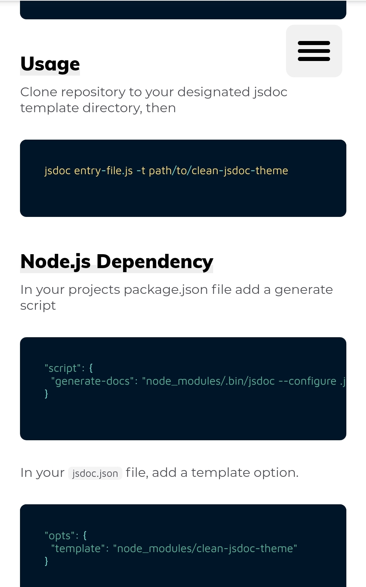

# clean-jsdoc-theme
[](https://github.com/ankitskvmdam/clean-jsdoc-theme) [](https://github.com/ankitskvmdam/clean-jsdoc-theme/fork)  [](https://github.com/ankitskvmdam/clean-jsdoc-theme/issues) [](https://github.com/ankitskvmdam/clean-jsdoc-theme/issues?q=is%3Aissue+is%3Aclosed) [](https://github.com/ankitskvmdam/clean-jsdoc-theme/graphs/contributors) [](https://www.npmjs.com/package/clean-jsdoc-theme) [](https://travis-ci.org/ankitskvmdam/clean-jsdoc-theme) [](https://github.com/ankitskvmdam/clean-jsdoc-theme/blob/master/LICENSE) [](https://ankdev.me/clean-jsdoc-theme/index.html)

<!--
[](https://travis-ci.org/ankitskvmdam/clean-jsdoc-theme) 
<a class="github-button" href="https://github.com/ankitskvmdam/clean-jsdoc-theme" data-icon="octicon-star" aria-label="Star ankitskvmdam/clean-jsdoc-theme on GitHub">Star</a> <a class="github-button" href="https://github.com/ankitskvmdam/clean-jsdoc-theme/fork" data-icon="octicon-repo-forked" aria-label="Fork ankitskvmdam/clean-jsdoc-theme on GitHub">Fork</a> <a class="github-button" href="https://github.com/ankitskvmdam" aria-label="Follow @ankitskvmdam on GitHub">Follow @ankitskvmdam</a> <a class="github-button" href="https://github.com/sponsors/ankitskvmdam" data-icon="octicon-heart" aria-label="Sponsor @ankitskvmdam on GitHub">Sponsor</a> <a class="github-button" href="https://github.com/ankitskvmdam/clean-jsdoc-theme/archive/master.zip" data-icon="octicon-cloud-download" aria-label="Download ankitskvmdam/clean-jsdoc-theme on GitHub">Download</a>
-->
<br>


A clean, responsive template / theme for JSDoc 3. This is created for those who love design. <br>
You can also search in your documenation. This theme / template includes search. It uses fuse.js for search.<br/>
live demo: https://ankdev.me/clean-jsdoc-theme/index.html
### Demo screen




## Install
> Note you must have `npm` installed on your machine.

On your command line type
```bash
npm install clean-jsdoc-theme
```

## Usage
Clone repository to your designated jsdoc template directory, then

```bash
jsdoc entry-file.js -t path/to/clean-jsdoc-theme
```

## Node.js Dependency
In your projects package.json file add a generate script
```json
"script": {
  "generate-docs": "node_modules/.bin/jsdoc --configure .jsdoc.json --verbose"
}
```

In your `jsdoc.json` file, add a template option.

```json
"opts": {
  "template": "node_modules/clean-jsdoc-theme"
}
```


## Example JSDoc Config
```json
{
    "source": {
        "include": ["lib", "package.json", "README.md"],
        "includePattern": ".js$",
        "excludePattern": "(node_modules/|docs)"
    },

    "plugins": [
        "plugins/markdown"
    ],

    "opts": {
        "encoding": "utf8",
        "readme": "./README.md",
        "destination": "docs/",
        "recurse": true,
        "verbose": true,
        "template": "./node_modules/clean-jsdoc-theme"
    }
}
```

## Features
We believe in giving freedom to the developer, that's why we have given many option to 
the developer to customize this time according to there needs.
You can pass an object called `theme_opts` under `opts` for more options like:
```javascript
"opts":{
  /*
    Default options
  */
  "theme_opts":{
    "title": "clean-jsdoc-theme", 
    /* 
      Instead of only string you can pass html element like 
      
      Path must be relative to the output file (relative to generated html files.) you 
      can use the absolute path.
      Note: If you use html the default overwrite. Also for custom class you have to create 
      a class using create_style.This is shown below.
    */

   "filter": false, /*  The default value is true. This will turn the color of image white. 
      If you did not want any
      filter set it to false.
   */
  
  // You can pass meta options also
  "meta": [
      "<meta name=\"author\" content=\"Ankit Kumar\">", 
      "<meta name=\"description\" content=\"Best Clean and minimal JSDoc 3 Template / Theme\">"
    ],
  // You can create custom style which will overwrite the exisiting class property.
  "create_style": "nav{background: yellow}" +     // This will change the background color of sidebar.
                  ".my-custom-class{ filter: brightness(10) grayscale(100%)}", // This will apply filter to my-custom-class
  
  //You can add path of your style file. Note it must be relative to your output file. (relative to generated html files.)
  "add_style_path": ["../custom.css"] // Pass array of path or url

  // You can add custom script to html
  "add_scripts": "function foo(){console.log('foo')}",

  // You can add path of your script file. Note it must be relative to your output file. (relative to generated html files.)
  "add_script_path": ["../custom.js"] // Pass array of path or url
  
  "footer": "This is footer",   // Here again you can pass html element 
  }
}
```
If this documentation is not enough feel free to create an issue.

## Developing
```bash 
git clone https://github.com/ankitskvmdam/clean-jsdoc-theme.git
cd clean-jsdoc-theme
npm install
npm run test
```
`npm run test` will generate files in output folder.

## Contact
If you like my work, then give me a <a href="https://github.com/ankitskvmdam/clean-jsdoc-theme" data-icon="octicon-star" aria-label="Star ankitskvmdam/clean-jsdoc-theme on GitHub">star</a>. This will act as a driving force to add new feature more frequently. <br>
Mail me at: hello@ankdev.me <br>
If you find any bug or need any feature in the future build feel free to open an issue at github: https://github.com/ankitskvmdam/clean-jsdoc-theme/issues


## License
Licensed under the MIT license.
