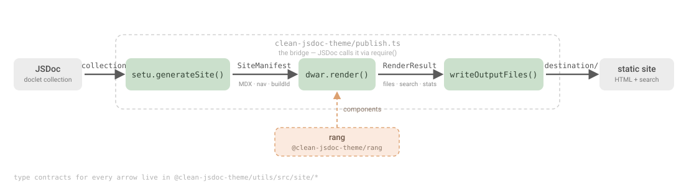

# Architecture

`clean-jsdoc-theme` v5 is a pnpm + Turborepo monorepo. JSDoc invokes a thin
bridge that wires four single-responsibility packages into a one-way pipeline,
producing a static documentation site (SSR HTML + a co-located `.md` per page for
LLMs + lazy-hydrated Preact islands + a fuzzy search index, plus an optional
Pagefind full-text index).

---

## The pipeline



**Boundary guarantees**

- The setu→dwar contract lives once, in `utils/src/site/*`. Both sides import it.
- **setu never imports dwar or rang** — the boundary is one-way.
- **dwar never re-reads doclets** — it consumes only a `SiteManifest`.
- **`dwar.render()` is pure** — no `fs`, no `process.cwd`, no logging. The only
  disk touch is `runPagefindAgainstDir` (a separate post-write step).
- **`dwar.render()` is resilient** — a single page that fails to compile (e.g.
  MDX that won't parse) is skipped and reported in `RenderResult.errors` (with a
  line/column + code-frame when the error is positioned), never thrown. One bad
  page can't abort the whole build; the bridge logs the skips. Non-fatal
  authoring slips that don't break the page — e.g. an unbalanced inline-code
  backtick — are surfaced separately in `RenderResult.warnings` (same located
  shape), so authors can clean up the source.
- **Slug rules live once** (`utils/.../slug-rules.ts`) — used by both setu (nav)
  and dwar (heading anchors).
- **Chrome markup lives once, in rang.** rang's `Layout`/`Header`/`Footer` own
  every byte of page-shell HTML. dwar's `SsrLayout` adds no chrome — it only
  wraps islands in `data-island` markers and passes them into rang's `Layout`
  slots (`headerControls` / `sidebar` / `toc`).

---

## Repository layout

```
clean-jsdoc-theme/
├── packages/
│   ├── utils/                 # @clean-jsdoc-theme/utils  — shared types + slug rules
│   ├── setu/                  # @clean-jsdoc-theme/setu   — JSDoc → SiteManifest
│   ├── rang/                  # @clean-jsdoc-theme/rang   — Preact component library
│   ├── dwar/                  # @clean-jsdoc-theme/dwar   — SiteManifest → HTML/CSS/JS
│   ├── clean-jsdoc-theme/     # clean-jsdoc-theme         — the JSDoc theme entry (bridge)
│   ├── typedoc/               # @clean-jsdoc-theme/typedoc — TypeDoc plugin (bridge)
│   ├── aadesh/                # @clean-jsdoc-theme/aadesh — theme CLI (clean-jsdoc; i18n group + build)
│   └── bhasha/                # @clean-jsdoc-theme/bhasha — pure i18n core
├── examples/
│   ├── basic/                 # working JSDoc fixture: `pnpm run docs` → dist/
│   ├── typedoc-basic/         # working TypeDoc fixture: `pnpm run docs` → dist/
│   └── with-i18n-example/     # 3-locale (en/ja/hi) localization fixture
├── docs-site/                 # dogfood docs site: prose-first `opts.docs` build
├── SKILLS/                    # downloadable LLM agent skills (per-skill folder + SKILL.md)
├── ARCHITECTURE.md            # this file
├── MIGRATION.md               # v4 → v5 migration guide
├── BREAKING_CHANGES.md
├── README.md
├── package.json               # workspace root
├── pnpm-workspace.yaml
├── turbo.json                 # task graph (build / test / lint / typecheck)
└── tsconfig.base.json
```

Tooling: **pnpm** workspace · **Turborepo** task orchestration · **tsup** builds ·
**vitest** tests · **TypeScript** project-wide.

---

## Packages

### `@clean-jsdoc-theme/utils` — shared contracts

The shared core every other package imports. Beyond the contracts + slug rules
it carries one block of **pure** runtime logic: `config/` — opts validation
(diagnostics, zod schemas, a Google-Font existence check, near-miss key
suggestions) and the Next.js-style build report. It stays browser-safe by
**injection**: the network (`fetch`) and `node:zlib` gzip sizer are passed in by
the caller, never imported here, so rang can still import utils in the browser.

```
utils/src/
├── doclet-schema.ts      # JSDoc doclet shape
├── salty.ts              # salty (taffy) collection helpers/types
├── site/
│   ├── page.ts           # Page (+ 'source' kind & raw-source body), Frontmatter, Heading
│   ├── manifest.ts       # SiteManifest, NavNode, SearchEntry
│   ├── render.ts         # OutputFile, RenderOptions, RenderResult, RenderError,
│   │                     #   RenderWarning + formatRenderError (shared by both bridges)
│   ├── theme.ts          # ThemeTokens, ThemeColors, ThemeConfig, ComponentOverrides
│   ├── site-name.ts      # SiteName (text | logo set) + siteNameText/resolveSiteLogo
│   ├── islands.ts        # IslandName union + IslandPropsMap
│   ├── slug-rules.ts     # slugifyHeading, slugifyPath, slugifySourcePath  (setu AND dwar)
│   └── index.ts          # barrel — the setu↔dwar boundary
├── config/               # PURE opts validation + build report (network/zlib injected)
│   ├── diagnostics.ts    # Diagnostic model + DiagnosticBag + formatDiagnostics
│   ├── opts-schema.ts    # zod schemas + THEME_OPT_KEYS
│   ├── site-name.ts      # validateSiteName (shape only — no I/O)
│   ├── locales.ts        # validateLocales (opts.locales/defaultLocale → ValidatedLocales; i18n off → undefined)
│   ├── fonts.ts          # validateFonts (heading/body existence-checked via resolver; per-locale keys)
│   ├── google-fonts.ts   # createGoogleFontResolver (injectable fetch; fail-open)
│   ├── suggest.ts        # near-miss "did you mean X?" key suggestions
│   ├── validate-opts.ts  # validateThemeOpts orchestrator → { value, diagnostics }
│   ├── report.ts         # formatBuildReport (per-route sizes + optional gzip)
│   ├── format.ts         # humanFileSize, byteLength, column padding, ANSI helper
│   └── index.ts          # config barrel
└── index.ts
```

### `@clean-jsdoc-theme/setu` — JSDoc → `SiteManifest`

Walks the salty doclet collection and produces one MDX page per documented
container symbol. Emits Markdown/MDX only — no HTML, no I/O. The one bit of JSX it
emits is capitalized MDX JSX — callouts (`<Callout type="info|tip|warning|error">`,
e.g. for `@deprecated`) and the `<Steps>`/`<Step>` + `<Tabs>`/`<Tab>` containers:
a plain `mdast` `data` field is dropped by `toMarkdown`, and lowercase literal
JSX bypasses MDX's component map, so these are emitted as capitalized MDX JSX
nodes (wired via `mdxJsxToMarkdown`) that round-trip through serialization and
arrive as props on the matching rang components (callouts → `MdxBlockquote`).
Prose authors reach these through markdown-friendly syntax that `from-html.ts`
rewrites BEFORE the MDX-hostile HTML round-trip strips it: GitHub-style alert
blockquotes (`> [!TIP]`, `> [!WARNING]`, … → callouts) and `<steps>`/`<tabs>`
container tags with `<step label>`/`<tab label>` items (→ the `<Steps>`/`<Tabs>`
JSX, inner content re-parsed recursively so nesting + callouts inside work).
**API coverage.** The five container kinds — class, interface, mixin, module,
namespace — render through one kind-parametric path (`getContainerView` →
`containerViewToMdast`): class keeps its constructor special case, and
class/interface additionally walk the `@augments`/`@extends` inheritance chain to
fold in inherited members. **Every class page** (unless `@hideconstructor`) gets a
**Constructor section** leading with a call signature (`constructorSignature` →
`new ClassName(id, [opts])`: top-level param names, optional → `[name]`, rest →
`...name`); a parameter-less class still shows a bare `new ClassName()`, and an
*undocumented* constructor (no `@param` tags) recovers its param names from
`meta.code.paramnames` (`constructorParamNames`, a signature-only fallback so the
Parameters table stays documented-only). Then the **separately-documented
constructor description** — when a class carries both a class-level doc comment
(`classdesc`, shown in the body) and a `constructor` doc comment (`description`),
the latter renders here, guarded so a single-comment class or a constructor-only
comment never duplicates — followed by the Parameters table. **Typedefs** get their own pages, and every
**global**-scope symbol that doesn't already own a page is collected onto a single
aggregated **"Globals"** page (each symbol a section; one nav entry). **events**,
**enums**, and **constants** are not standalone — they render as member sections
within their parent container's page. Alongside the
API, two free-form prose sources are also rendered as pages: the project
**README** (`opts.readme`, which JSDoc has already rendered to HTML) becomes the
site **home page** (slug `''` → `index.html`), and **tutorials** (the
`--tutorials` tree) become **guide pages** under `tutorials/<name>`, in a
"Tutorials" section whose **sub-tutorials nest** as collapsible groups mirroring
JSDoc's resolved hierarchy (a parent with children opens a `Tutorials/<title>`
group with its own page first; a flat set stays one "Tutorials" group). Both
flow through the same MDX → dwar path as class pages. Every prose source is
normalized to structured mdast before serialization (README + HTML tutorials via
`htmlToMdastBlocks`; Markdown tutorials via `markdownToMdastBlocks`, which routes
Markdown → HTML → the same converter). This is deliberate: raw Markdown is GFM,
not MDX, so passing it through verbatim lets MDX-hostile constructs — angle-bracket
autolinks (`<https://…>`), void/unclosed raw HTML (``) — abort the page
compile in dwar. The HTML round-trip lowers everything to structured nodes (links,
images, tables — no raw HTML), and `toMdx` serializes links in resource form
(`[text](url)`, never `<url>`) so nothing MDX-hostile survives. GFM (tables, task
lists, strikethrough, footnotes) is preserved throughout.

**Embeds.** Sandboxed iframes (CodePen, live demos) lower to a capitalized
`<Embed>` MDX JSX node — the same round-trip as callouts — from two sources:
the `@iframe` **block tag** on any doclet (`@iframe <url> key=value …`, parsed by
`embedBlocks` in `mdast/doclet.ts`, rendered after `@example`) and an
` ```iframe ` **prose fence** in README/tutorial/doc Markdown (lowered in
`guide-view.ts`). Both share one config grammar (`embed.ts` `parseEmbedConfig`:
first token = URL, rest `key=value`; `https://`/protocol-relative only, else
dropped with a warning). The `@iframe` tag requires `tags.allowUnknownTags: true`
in `jsdoc.json` so the unknown tag survives into `doclet.tags`; the prose fence
needs no config.

**Docs directory.** A prose-first **docs site** is built from a directory of
Markdown/HTML files (`opts.docs`): the bridge walks it (it's the I/O layer; setu
stays disk-free) and hands setu a flat `DocInput[]` — each a POSIX relative path
(no extension), the raw content, and a `type`. `buildDocPages` then turns each
into a page where the **filesystem layout drives the URL and the sidebar group**:
the slug is the relative path with **no prefix** (`guides/advanced.md` →
`/guides/advanced`), and the group is the humanized parent directory
(`guides/` → "Guides"). A leading `---\n…\n---` YAML **frontmatter** block
(`parseFrontmatter`, dependency-light) overrides per file — `title`, `group`,
`order`, `slug`, `hidden` all win over the directory/humanized fallbacks; a
file with no frontmatter falls back to its folder's group and a humanized
filename title. A doc with no group at all lands in `opts.defaultDocGroup`. The
root `index.md` (`path === 'index'`) becomes the **home page** (slug `''`,
`kind: 'index'`), overriding the README home; otherwise the README still wins.
Doc-group sidebar sections render in `opts.docGroups` order, after the API
sections. A doc whose slug would shadow the home or an already-claimed
API/source/tutorial slug is skipped + logged (never throws), mirroring the
synthetic-globals skip. Tutorials and docs share **one** builder: tutorials are
routed through `tutorialsToDocInputs`, a thin adapter that synthesizes a
`DocInput` per tutorial (`tutorials/<name>`, incrementing order) with frontmatter
parsing disabled. Its **group encodes the hierarchy** (issue #253): a tutorial
with sub-tutorials opens a `Tutorials/<title>` group holding its own page +
children; a leaf sits in its parent's group; a flat set is one "Tutorials" group
(then byte-identical to before). `assembleNav` feeds these paths to
`buildGroupTree` like any `@category` path — page slugs/bodies are unchanged,
only the nav nests.

**Link resolution.** `{@link}`/`{@linkcode}`/`{@linkplain}` inline tags and `@see`
block tags become real anchors. setu builds a link registry (`link-registry.ts`)
from the page set it actually generates — a two-pass build: pass 1 populates the
registry (`longname → {slug, #anchor}`) for every page-level symbol and member
heading; pass 2 renders each page with a resolver closed over the full registry,
so forward references resolve. `resolveLinkTags` (`mdast/link-tags.ts`) and the
`@see` handler in `mdast/doclet.ts` then rewrite namepaths into page-slug +
`#member` heading anchors. External URLs (`http(s)://`, `mailto:`) link directly
(rang's `MdxA` opens `^https?://` in a new tab); unresolved namepaths fall back to
inline code, the look JSDoc text had before, and dwar's `preprocessJsdocInlineTags`
stays as a final safety net so any tag that still reaches MDX compile can't break
the page. The resolver also has a **unique short-name fallback**: a bare authored
name (`{@link BaseEntity}`) resolves to its symbol only when that short name is
unambiguous across the whole registry — ambiguous names refuse to resolve rather
than guess. Known v1 limitation (see `docs/plan-link-resolution.md`): member
anchors are bare `slugifyHeading(name)` without the per-page dedup counter, so a
member whose heading slug collides on its page may get a slightly-off anchor.

Source files are a third output, gated by the bridge's `outputSourceFiles` flag
(default on). When enabled, every documented source file becomes a hidden
`kind: 'source'` viewer Page (raw text on `Page.source`, no MDX body) plus a flat
**"Source Files"** index page, and each class member gains a `Source: file:line`
link — `source-view.ts` resolves the doclet `meta` (`path`/`filename`/`lineno`)
to `/source/<file>/#L<n>`, with the page slug and the link target sharing
`slugifySourcePath` so they always agree. By default the link lands on the first
line of the **declaration**: a container's documented doclet points `lineno` at
its doc-comment, so `firstCodeLine` skips past the comment block to the code (the
`sourceLinkToComment` option opts back into the comment line).

**Sidebar nav.** `assembleNav` gives every entry — API pages, docs, tutorials —
one uniform `group` **path** and builds a nested sidebar from it. An API page's
group comes from an `@category` doclet tag (`@category Core/Parsing` → group
`Core/Parsing`; first tag wins, parsed in `renderContainerPage`), falling back to
the kind label (Classes / Modules / …) for untagged symbols; doc/tutorial pages
use their frontmatter group. The tag also accepts trailing `key=value` options:
`@category Core/Parsing order=1` sets the page's `frontmatter.order` (the path is
the leading tokens, options follow the first `=`). A standalone **`@order N`**
block tag (`readOrder`) sets the same `frontmatter.order` for **any** symbol —
including a plain `@module`/`@class`/`@namespace` that has no `@category` and
lives in its kind section; when both are present the inline `@category … order=`
wins. The path's **first segment** is the top-level group
(a bold, non-collapsible title via rang's `groupNav`); deeper `/`-segments become
nested, collapsible branch nodes (`buildGroupTree`) — so the renderer's existing
arbitrary-depth `NavEntry` recursion handles nesting with no rang change. One
generalized `sectionOrder` orders top-level groups: listed labels first (a _kind_
label it omits is dropped — the legacy filter), then category/doc groups it
doesn't list, appended alphabetically (doc groups pinned by `docGroups` keep that
order). Within a deepest group, API and doc entries sort by `frontmatter.order`
then title (tutorials keep their builder's tree order); and sibling **subgroups**
(branch nodes) sort by the min `order` of the pages inside them, so `@category
Core/Schema order=2` lands after `Core/Processing order=1`. The whole pass is
backward compatible — an untagged collection with a kind-only `sectionOrder`
yields byte-identical nav (unordered siblings keep leaves-before-branches,
first-seen order). With `clubSidebarItems` on, `clubNavTree` additionally
collapses a section's entries into a one-level parent/child tree by the path
segment before the first `/` (`queue`, `queue/Queue`, `queue/types` → a `queue`
parent; the bare `queue` module becomes an `index` child); a prefix used by a
single entry stays flat. Clubbing is order-aware: a clubbed parent sorts by the
min `order` of its members (so `@order` on any member floats the parent up) and
children sort by `order` then the `index`-first tiebreak then name — with no
`@order`/`order=` it falls back to first-seen parents and `index`-first children
(byte-identical). Clubbing applies ONLY to category-less buckets (a group
built from `@category` paths is already nested and is not additionally clubbed).

```
setu/src/
├── index.ts              # generateSite(collection, opts) → SiteManifest  (entry;
│                         #   opts carries pkg + readme HTML + tutorial tree + sources
│                         #   + sectionOrder + menu + clubSidebarItems + sourceLinkToComment)
├── generate-site.ts      # enumerate containers by kind, two-pass build (link
│                         #   registry before render), container/typedef/globals
│                         #   pages (parsing `@category [order=N]` →
│                         #   frontmatter.group/order),
│                         #   assembleNav (sidebar: optional `menu` top region →
│                         #   divider → nested @category/group sections ordered by
│                         #   the generalized `sectionOrder`; buildGroupTree nests
│                         #   `/`-paths; clubNavTree groups category-less buckets
│                         #   by path prefix when clubSidebarItems is on), buildId
├── guide-view.ts         # README → home Page; DocInput[] → guide Pages + nav
│                         #   (buildDocPages: frontmatter/directory slugs+groups,
│                         #   root index.md → home); tutorialsToDocInputs adapter
│                         #   (tutorials → DocInput[]; group encodes the hierarchy
│                         #   as Tutorials/<parent> → nested collapsible nav, #253)
├── source-view.ts        # source files → hidden 'source' viewer Pages + "Source
│                         #   Files" index + per-member meta→/source/…#L<n> resolver
│                         #   (firstCodeLine: land on the declaration, not the comment)
├── validate.ts           # validateCollectionOrThrow
├── doclet.ts             # doclet access helpers
├── class-view.ts         # container doclet → structured view model
│                         #   (getContainerView, kind-parametric; getClassView alias)
├── name-registry.ts      # longname → slug/path resolution
├── link-registry.ts      # longname → {slug,#anchor} registry + makeLinkResolver
│                         #   ({@link}/@see → href; unique short-name fallback)
├── embed.ts              # parseEmbedConfig — shared @iframe / ```iframe config
│                         #   grammar (URL + key=value; https/protocol-relative only)
├── slots.ts              # i18n: SlotResolver + SlotCollector (collect translatable
│                         #   SlotEntry[]) + makeSlotTranslator (per-locale stamp)
├── helper.ts
├── mdx.ts                # mdast → MDX string (resource-form links only, so no
│                         #   `<url>` autolink reaches dwar's MDX compile)
└── mdast/
    ├── builders.ts       # mdast node builders
    ├── class-view.ts     # container view model → mdast (containerViewToMdast)
    ├── doclet.ts
    ├── link-tags.ts      # resolveLinkTags: rewrite {@link}/{@linkcode}/
    │                     #   {@linkplain} text nodes → anchors (skips code spans)
    └── from-html.ts      # HTML / Markdown → structured mdast (the MDX-safe
                          #   normalization shared by README + tutorials)
docs/                     # architecture.md, how-jsdoc-works.md, …
```

### `@clean-jsdoc-theme/rang` — Preact component library

The components dwar server-renders and bundles. Ships SSR chrome, hydratable
islands, the MDX element map, the island registry, and shadcn-style primitives.
Styled with Tailwind utility classes referencing CSS variables (`--clean-*` and
the shadcn semantic aliases).

```
rang/src/
├── index.ts              # public exports
├── islands.ts            # ISLAND_REGISTRY: Record<IslandName, Component>
├── mdx-components.tsx     # defaultMdxComponents — the MDX element → component
│                         #   registry (wires up mdx-utils / mdx-tags / CodeBlock)
├── lib/
│   └── cn.ts             # clsx + tailwind-merge (shadcn helper)
└── components/
    ├── Brand.tsx        # site identity: renders siteName as text OR a per-theme
    │                     #   logo image (dark/light swap via CSS only). Shared by
    │                     #   Header / Footer / MobileNav
    ├── Button.tsx        # shadcn-style Button (cva variants/sizes) + buttonVariants
    ├── ButtonGroup.tsx   # shadcn-style segmented group: flattens adjacent buttons'
    │                     #   inner corners + collapses their shared border (split button)
    ├── Dialog.tsx        # shadcn-style Dialog (Preact-native; overlay+blur, focus trap,
    │                     #   scroll lock, presence/animation) + Header/Title/Body/Footer.
    │                     #   align: center/top modal OR left/right side-sheet (drawer)
    ├── DropdownMenu.tsx  # shadcn-style menu (Preact-native; compound root/trigger/
    │                     #   content/item/separator/label; outside-click + Esc close,
    │                     #   roving arrow-key focus)
    ├── Layout.tsx        # slot page shell (SSR; toc rail only when toc slot set)┐
    ├── Header.tsx        # site header (SSR)            │ chrome
    ├── Footer.tsx        # site footer (SSR; renders `ThemeConfig.footer` author
    │                     #   HTML verbatim when set, else the default footer)  ┘
    ├── Sidebar.tsx       # island: menu region (icon links: lucide/┐ (+ SidebarItem
    │                     #   simpleicons CDN) + divider + grouped nav │  action row);
    │                     #   clubbed parents are collapsible (chevron, localStorage-
    │                     #   persisted) and scroll the active item into view on load
    ├── MobileNav.tsx     # island: < md nav drawer      │  (reuses Dialog sheet +
    │                     #   SidebarItem + useThemeMode + SettingsDialog + Sidebar)
    ├── TOC.tsx           # island: curved right-rail TOC │
    ├── TocPopover.tsx    # island: < lg mobile TOC bar   │  (progress ring +
    │                     #   expandable list; shares toc-utils with TOC)         │
    ├── toc-utils.ts      # shared scroll-spy: useActiveHeadings (rail set),       │
    │                     #   useTocProgress / getActiveHeadingIndex (mobile),     │
    │                     #   getItemOffset / getLineOffset (depth indentation)    │
    ├── CtrlK/            # island: command palette (folder) — fuzzy search │ islands
    │                     #   (search-utils) over the fetched index + recent &
    │                     #   favorite searches (use-saved-searches, localStorage),
    │                     #   split into sub-components + a shared keyboard-nav hook
    ├── search-utils.ts   # dependency-free fuzzy matcher (fuzzyMatch / fuzzySearch /
    │                     #   highlightSegments) — fzf-style scoring for CtrlK
    ├── Settings.tsx      # island: settings (+ SettingsDialog, controlled)
    ├── ThemeToggle.tsx   # island: light/dark (+ useThemeMode hook)
    ├── LanguageSwitcher.tsx # island: locale dropdown (lucide Languages icon) —
    │                     #   navigation to the same page in each locale; renders
    │                     #   nothing for a single locale. Localized builds only
    │                     #   (after search on desktop, before the nav trigger on mobile)
    ├── CodeTabs.tsx      # island: tabbed code
    ├── CopyBtn.tsx       # island: clipboard (code blocks)
    ├── CopyPageButton.tsx # island: copy-page split button (ButtonGroup + DropdownMenu):
    │                     #   copy the page .md, view it, or open in Claude/ChatGPT/
    │                     #   Perplexity (prompt + .md link, never the page body)
    ├── PageNav.tsx       # SSR prev/next pager: two rounded-lg bordered cards (label
    │                     #   + page title + ≤100-char description) linking the
    │                     #   adjacent pages in sidebar reading order (no island)
    ├── Steps.tsx         # MDX: <Steps>/<Step label> — SSR numbered stepper (no island)
    ├── Tabs.tsx          # MDX: <Tabs>/<Tab label> — tabbed view; SSR ARIA tablist +
    │                     #   panels in a data-island="tabs" marker, DOM-enhanced (not
    │                     #   hydrated — the panels hold arbitrary rendered MDX)
    ├── icons/            # inlined brand SVGs (ChatGptIcon ← chatgpt.svg)
    ├── CodeViewer.tsx    # island: read-only Monaco source viewer (CDN-loaded)
    ├── Embed.tsx         # island: sandboxed iframe (Embed marker + EmbedBody body);
    │                     #   optional click-to-load poster + {theme}-token sync
    ├── mdx-utils.tsx     # MDX shared utils: BaseProps, makeHeading, HeadingAnchor
    │                     #   (hover link button), cx, textContent
    ├── mdx-tags.tsx      # MDX tag renderers (headings, links, lists, tables, …)
    │                     #   + SourceLink (Source: file:line caption),
    │                     #   MemberMeta (member row: modifier/kind chips left,
    │                     #   filename:line source pinned right), MemberHeading
    │                     #   (h{depth} whose content is one shiki-highlighted
    │                     #   inline <code> signature, explicit id so the anchor
    │                     #   stays #name) + Signature (standalone sig block) +
    │                     #   SignatureCode/SignatureHighlightContext (shiki inline)
    └── CodeBlock.tsx     # block code (the MDX `pre`, used as MdxPre) + inline
                          #   `Code` (MDX `code`); also serves CodeTabs + standalone
```

**Islands** (`IslandName`, 15): `sidebar`, `mobile-nav`, `toc`, `toc-mobile`,
`cmdk`, `code-tabs`, `copy-btn`, `copy-page`, `theme-toggle`, `settings`,
`language-switcher`, `code-viewer`, `embed`, `playground`, `tabs`.
Each renders meaningful SSR HTML, then progressively enhances after hydration.
The `cmdk` palette lazily fetches the search index on first open and ranks hits
with a fuzzy matcher (`search-utils`) across weighted fields — title (highest,
and what's highlighted), then description and full page content — so README
prose, member descriptions, and identifiers are all findable, not just titles.
The index also carries a deep-link entry per member (each H3+ heading →
`slug#anchor`), so a static field / method / property is found by name and the
hit jumps straight to it. With an empty query the palette shows **recent and
favorite searches** instead — recents are tracked automatically and favorites
are starred, both persisted to `localStorage` (`use-saved-searches`). The
`copy-page` split button
(content pages only, not the source section) copies the page's companion `.md`,
opens it, or hands its raw-Markdown link to an LLM — it's configurable via
`ThemeConfig.copyPage` (`enabled` + which `actions`). The `mobile-nav` drawer
composes the others (theme toggle, settings, sidebar) rather than duplicating
them; it shows below `md`, where the header keeps the search trigger, the
language switcher (localized builds), and the nav-drawer trigger, and the
sidebar column is hidden. `toc` (the curved right rail) and `toc-mobile` (the
`< lg` progress-bar popover, `TocPopover`) are two presentations of the same
headings — both hydrate but only one is visible per breakpoint; they share their
scroll-spy and indentation logic via `toc-utils`. The `code-viewer` island
(source pages only) renders a byte-exact `<pre>` fallback, then lazy-loads a
read-only Monaco editor from the jsdelivr CDN (never bundled): it reads its code
back from that `<pre>`, reveals the `#L<n>` deep-link line, and re-themes off the
`<html data-theme>` attribute (a `MutationObserver`, since the toggle is a
separate island) with custom themes whose background matches the site's pinned
code surface. The `embed` island (in-content, no JSON payload — config rides on
the marker's `data-*`, like `copy-btn`) renders a sandboxed `<iframe>` for
`<Embed>` nodes: a live iframe by default (works with no JS), or a click-to-load
poster `<button>` (+ `<noscript>` fallback) that swaps in the iframe on click.
Theme sync is **on by default** (opt out with `themed=false`): the URL is
re-resolved off `<html data-theme>` via the same `MutationObserver` pattern —
a `{theme}` token is swapped, else `?theme-id=<theme>` is appended unless the
author already declared a `theme-id` query param. The `playground` island
(in-content, like `embed`/`copy-btn`) is the "Open Code in" dropdown in a code
block's header: it reads the enabled providers from the marker's `data-providers`,
the code from the card's `<pre>`, and the site-wide per-provider options from a
per-page `data-playground-config` payload, then opens the example prefilled in
CodePen / JSFiddle / CodeSandbox via a client-side form POST / parameterized link
(no backend). The `<Playground>` wrapper (setu) also drives the code block's
`filename` header label and line `highlight`ing through a Preact context the
`CodeBlock` reads at SSR.

### `@clean-jsdoc-theme/dwar` — `SiteManifest` → HTML/CSS/JS

A pure renderer. Server-renders pages, bundles the islands in one split build (a
shared chunk + a content-hashed entry chunk per island), emits CSS, and exposes
a separate Pagefind step.

```
dwar/src/
├── index.ts              # render(manifest, opts) → RenderResult  (entry). Renders
│                         #   each page in try/catch — a page that fails to compile
│                         #   is skipped + reported in RenderResult.errors (codeFrame
│                         #   snippet when positioned), not thrown. Also flags unbalanced
│                         #   inline-code backticks into RenderResult.warnings (non-fatal).
│                         #   kind:'source' pages skip MDX and mount the code-viewer
│                         #   island directly (code stays in the SSR <pre>, off the payload)
├── layout.tsx            # SsrLayout — island-seam adapter: wraps islands in
│                         #   data-island markers, then composes rang's Layout
│                         #   via its slots (emits no chrome of its own). Search
│                         #   + the language switcher stay visible on all
│                         #   breakpoints; theme/settings are desktop-only (they
│                         #   live in the mobile nav drawer), so < md the header
│                         #   keeps search + switcher + the mobile-nav trigger. Exposes
│                         #   renderIsland() (id alloc + marker), reused for source pages
├── mdx.ts                # @mdx-js/mdx compile + run (Preact runtime, frontmatter,
│                         #   remark-gfm for tables/strikethrough/task-lists,
│                         #   + rehype slug pass giving headings ids that mirror
│                         #   setu's TOC exactly — slugifyHeading + per-page registry).
│                         #   Pre-pass: {@link} → code spans + escapeStrayBraces (literal
│                         #   {…} in JSDoc prose escaped so MDX won't read it as JS;
│                         #   inline-code matching follows CommonMark — a code span can't
│                         #   cross a blank line — so a stray backtick can't desync a
│                         #   whole page). findStrayBackticks flags those unbalanced ticks.
├── html.ts               # HTML document skeleton, slug→path, excerpt, payload escaping
│                         #   + author <meta> tags (ThemeConfig.meta: defaults first,
│                         #   de-dupe by identifying attr, escaped, invalid keys dropped)
├── css.ts                # buildThemeVariableCss (:root + [data-theme=dark] tokens)
│                         #   + the prebuilt UTILITY_CSS  →  one stylesheet
├── generated/
│   └── utility-css.ts    # AUTOGENERATED Tailwind output (inlined string)
├── islands-bundle.ts     # esbuild: ONE split build → a shared chunk (Preact + rang)
│                         #   + a content-hashed entry chunk per island; opt-in
│                         #   on-disk cache keyed on rang/dwar/preact content
├── islands-loader.ts     # inline loader (lazy-imports only chunks present on page,
│                         #   by hashed name; copy-btn + code-viewer read text from the
│                         #   DOM <pre>; tabs is DOM-enhanced, not Preact-hydrated)
├── theme-script.ts       # pre-hydration <script>: theme + font-size/line-spacing
├── heading-anchors.ts    # inline <script>: delegated heading clicks → hash +
│                         #   copy link; sets data-copied 3s for the check-icon swap
├── pagefind.ts           # runPagefindAgainstDir(destination)  — the only fs touch
styles/
└── tailwind.css          # Tailwind v4 input: @theme tokens, tw-animate-css, base
scripts/
├── build-css.mjs         # compiles tailwind.css via the v4 CLI → generated/utility-css.ts
└── smoke.ts              # end-to-end render to preview/ (manual check)
```

**CSS strategy.** Tailwind v4 is compiled **once at dwar's own build time**
(`build-css.mjs`, run before `tsup`) and inlined into `generated/utility-css.ts`.
Tailwind never runs at the consumer's `jsdoc` build, so `render()` stays pure and
users need no Tailwind config. The static utility layer is determined by rang's +
dwar's source; only the `:root` / `[data-theme="dark"]` token block is dynamic
(emitted per `ThemeConfig` at render time). Shadcn semantic colors
(`background`, `foreground`, `primary`, `muted`, `accent`, `border`, `ring`) are
mapped onto `--clean-*` via `@theme`, and the palette ships explicit OKLCH light
and dark values. A `@custom-variant dark` rebinds the `dark:` utility variant to
`[data-theme="dark"]` (the theme toggle's signal) instead of the OS
`prefers-color-scheme`, and `--color-primary-light` derives a lighter accent via
relative `oklch()` for dark-mode emphasis (e.g. the selected sidebar item). The
heading/body/mono families are also exposed as `font-heading` / `font-body` /
`font-mono` utilities (mapped onto the `--clean-font-*` vars).

**`render()` emits:** `<slug>/index.html` per page (with a pre-hydration theme
script before the stylesheet and the inline heading-anchors script before
`</body>`), a co-located `<slug>/index.md` per content page (the page's MDX body
verbatim — for LLMs + the copy-page button; source-viewer pages have none),
`_assets/styles.<buildId>.css`, `_assets/search-index.<buildId>.json` (the fuzzy
search index the `cmdk` island fetches — a `SearchEntry` per non-hidden page,
each carrying `title` + `description` + full-text `content`, plus a deep-link
entry per member heading), `_islands/<name>.js` per island, a
per-page `data-island-props` JSON payload, and `RenderResult.search` (one
`SearchEntry` per non-hidden page; the on-disk index adds the member entries).
Content pages also mount the `copy-page`
island above the body (gated by `ThemeConfig.copyPage`, never on the source
section), and a **prev/next pager** (rang's `PageNav`) below the body: dwar
flattens `manifest.nav` into linear reading order (skipping external/menu
entries), maps each non-hidden page to its neighbors, and renders the two cards
(title + ≤100-char description). Gated by `ThemeConfig.pageNav` (on by default),
never on source pages. The full-text Pagefind bundle is a separate post-write step.

**Custom CSS/JS.** `ThemeConfig` carries optional `customCss`/`customJs` (inline
strings) and `customCssLinks`/`customJsLinks` (asset hrefs). Inline strings are
injected per-page (`<style>` / classic `<script>`); the link arrays become
`<link>` / `<script src>`. The bridge owns the file I/O: it copies each custom
file **as-is** to a content-hashed asset (`_assets/<name>.<hash>.css`, so an
unchanged file keeps a stable cacheable URL — `hashCustomAssets: false` skips the
hash), writes it alongside the logos, and passes only the hrefs in — so
`render()` stays pure. Custom CSS loads **after** the theme stylesheet (so it
overrides); custom JS runs **last**, after the theme's own scripts. Both inline
paths are guarded against `</style>` / `</script>` break-out.

**Custom footer.** `ThemeConfig.footer` is a resolved HTML **string** that rang's
footer slot renders verbatim in place of the default `Footer` (trusted,
author-controlled — v4 parity; style it via the custom-CSS keys). The opts layer
accepts a `string | { file }` union, but the **bridge** reads the `{ file }` form
from disk and threads only the final string in, so the setu→dwar boundary stays a
plain `string` and `render()` stays pure. dwar's `SsrLayout` just passes it into
rang's `Layout` footer slot — it adds no chrome.

**Custom meta.** `ThemeConfig.meta` is an array of attribute maps that dwar's
`html.ts` emits as `<meta>` tags in `<head>`. The theme's own defaults
(charset, viewport, the auto `description`) emit **first**, then the author
entries — but a default is **skipped** when an author entry shares its
identifying attribute (`name` / `property` / `http-equiv` / `charset`), so an
author `description` replaces the auto one rather than duplicating it. Values are
HTML-escaped and attribute names validated (a crafted key is dropped), so it's
pure inline data — `render()` does **no** I/O for it (no file form, unlike the
footer). The bridge only normalises/validates the array (dropping junk entries
with a warning).

### `clean-jsdoc-theme` — the JSDoc theme entry

The package JSDoc loads via `jsdoc -t clean-jsdoc-theme`. A thin orchestrator.

```
clean-jsdoc-theme/src/
├── publish.ts            # publish(taffyData, opts, tutorials) — the entry.
│                         #   resolves pkg + theme (opts.siteName / fonts → tokens),
│                         #   normalizes the README (→ home) + tutorial tree (→ guides)
│                         #   into setu opts, calls setu → dwar, writes files, runs
│                         #   Pagefind. siteName is text OR a logo set — local logo
│                         #   images are copied to content-hashed _assets/logo-<key>.<hash>.<ext>.
│                         #   Validates opts early
│                         #   via utils validateThemeOpts (diagnostics + live Google-Font
│                         #   check + unknown-key "did you mean" suggestions); a bad
│                         #   font/typo only WARNS by default (resilient — missing fonts
│                         #   fall back to the default), unless opts.strict escalates
│                         #   errors to a hard failure. Prints the utils formatBuildReport
│                         #   (per-route sizes + gzip; node:zlib injected) after write,
│                         #   plus any RenderResult.errors (skipped pages) +
│                         #   RenderResult.warnings (e.g. unbalanced backticks).
│                         #   Collects source files from doclet meta (gated by
│                         #   templates.default.outputSourceFiles, default on) → setu;
│                         #   templates.default.sourceLinkToComment toggles whether a
│                         #   Source: link lands on the declaration (default) or comment.
│                         #   Normalizes opts.sectionOrder + opts.menu + opts.clubSidebarItems
│                         #   → setu, and opts.aiPrompt + opts.copyPage + opts.pageNav +
│                         #   opts.colors/darkColors (per-key merge over the default
│                         #   palettes) → theme.
│                         #   Reads opts.customCss/customJs (inline) + reads
│                         #   opts.customCssFile/customJsFile from disk → theme
│                         #   (dwar emits/links them; render() stays pure).
│                         #   resolveFooter: opts.footer (string | { file }) →
│                         #   ThemeConfig.footer string ({ file } read here).
│                         #   normalizeMeta: opts.meta (attribute maps) →
│                         #   ThemeConfig.meta (junk dropped+warned; dwar escapes).
│                         #   Walks opts.docs (collectDocs: recursive, *.md/*.markdown/
│                         #   *.html → DocInput[] w/ POSIX rel path + raw content; the
│                         #   only place the docs tree is read) and threads docs +
│                         #   opts.docGroups + opts.defaultDocGroup → setu.
│                         #   resolveDocImages then routes every local image those docs
│                         #   reference through the content-hashed _assets/ pipeline
│                         #   (copy + rewrite src), and additionally collects each .svg's
│                         #   markup into render()'s inlineSvgs map so it's inlined
│                         #   (theme-toggle-aware) rather than -ed.
│                         #   Holds defaultTheme (OKLCH palette).
└── write-output-files.ts # mkdir -p + writeFile loop (forward-slash → OS path)
```

setu and dwar are ESM-only; JSDoc 4 uses `require()`, so `publish.ts` (CJS) loads
them via dynamic `import()` of a resolved `file://` URL.

### `@clean-jsdoc-theme/typedoc` — the TypeDoc plugin

The TypeDoc twin of the JSDoc bridge: it feeds TypeDoc's reflection tree through
the SAME `setu → dwar` pipeline, so a TypeDoc project gets identical output (SSR
HTML + co-located `.md` + lazy islands + fuzzy search + optional Pagefind). A
TypeDoc **plugin** (`load(app)`) that registers a custom **output** — selected
via the `outputs` option, not a CSS theme extending `DefaultTheme`. ESM all the
way, so setu/dwar/utils are imported directly (no CJS dynamic-import dance).

```
typedoc/src/
├── index.ts                # load(app) — declares the cleanJsdocTheme option,
│                           #   registers app.outputs.addOutput('clean-jsdoc-theme',
│                           #   writeSite). Selected via typedoc.json `outputs`.
├── write-site.ts           # the output writer (path, project, app): reads +
│                           #   validates the cleanJsdocTheme block (utils
│                           #   validateThemeOpts, unknownKeyPolicy 'warn-all' since
│                           #   it's a dedicated namespace; bad font/typo only WARNS
│                           #   unless `strict`), adapts reflections → TDoclet[] →
│                           #   salty.taffy → setu generateSite → dwar render →
│                           #   write files → Pagefind. Threads validated siteName/
│                           #   fonts + normalized sectionOrder/menu/clubSidebarItems/
│                           #   copyPage/pageNav/aiPrompt through, and walks the
│                           #   `docs` dir (docs.ts) → docs + docGroups/
│                           #   defaultDocGroup + inlineSvgs. Prints the utils
│                           #   formatBuildReport (node:zlib gzip sizer — allowed here,
│                           #   it's the bridge, not utils). Holds defaultTheme.
├── docs.ts                 # prose-docs front-end (copied from the JSDoc bridge):
│                           #   collectDocs (walk dir → DocInput[]) + resolveDocImages
│                           #   (local images → content-hashed _assets/ + inline SVGs).
├── reflection-to-doclets.ts# THE adapter: ProjectReflection → flat TDoclet[].
│                           #   Class/Interface/Function/Method/Property/Variable/
│                           #   Accessor/Enum(+isEnum)/EnumMember/TypeAlias(typedef)/
│                           #   Module/Namespace. Constructor params fold into the
│                           #   class; Reference/re-exports deferred (logged). Matches
│                           #   kinds via reflection.kindOf (bitflags), never ===.
├── names.ts                # synthesize longname/memberof/scope with #/./~ +
│                           #   module: prefixes setu queries against.
├── comment.ts              # Comment/CommentDisplayPart[] → HTML (mdast→hast→html,
│                           #   setu's pipeline) + {@link} → JSDoc {@link}; block tags
│                           #   → params/returns/throws/examples/deprecated/see/category.
├── types.ts                # TypeDoc Type → { names: [type.toString()] } (v1).
├── options.ts              # the cleanJsdocTheme ParameterType.Object declaration +
│                           #   typed reader (siteName/fonts/sectionOrder/docs/
│                           #   docGroups/defaultDocGroup/menu/clubSidebarItems/
│                           #   copyPage/pageNav/aiPrompt/strict).
└── write-output-files.ts   # mkdir -p + writeFile loop (copied from the JSDoc bridge).
```

`NOTES.md` records the verified TypeDoc 0.28.x API facts the adapter relies on.
The two bridges are independent leaf packages — pure helpers (`write-output-files`,
`collectSourceFiles`) are copied, never cross-imported.

**Document-model flavor (TypeDoc parity).** setu's `generateSite` takes a
`flavor: 'jsdoc' | 'typedoc'` (default `'jsdoc'`); the TypeDoc bridge passes
`'typedoc'`, the JSDoc bridge passes nothing — so the JSDoc **document model**
(pages, sections, labels) is unchanged: every parity behavior below is
flavor-gated. (Signature rendering, further down, is the one cross-cutting change
that applies to both flavors.) Under `'typedoc'`, setu
matches default TypeDoc's structure: **enums, top-level functions, and variables
each become a standalone page** in their own kind-section (a "Pass 1b" alongside
the container pass; a function/variable that is a class/interface/enum *member*
stays inside its owner), type aliases are labelled **"Type Aliases"** (vs
"Typedefs"), class pages use TypeDoc section labels (**Constructors / Properties /
Accessors / Methods** — accessors routed by the bridge's `isAccessor` flag), enum
pages render an **"Enumeration Members"** section, and **module/namespace pages
become a kind-grouped index of links** to their exports instead of inlining member
bodies. Generics render a structured **"Type Parameters"** section from the
doclet's `typeParams` (populated only by the TypeDoc bridge, so the section is
safe to emit unconditionally). The link registry pre-seeds each page's own
longname so a cross-reference always resolves to the symbol's page, never a stale
`module#member` anchor; and the sidebar shows every kind section even when a
user's `sectionOrder` omits some. **Overloaded** functions/methods render every
call signature: the TypeDoc bridge keeps the first signature on the doclet and
carries the rest on `overloads[]` (`reflection.signatures[1..]`); setu then keeps
the member heading a bare name and stacks one inline `<Signature>` per overload,
each with its own Type Parameters / Parameters / Returns (and an overload's own
description), while the shared description/examples render once — matching default
TypeDoc. JSDoc never sets `overloads`, so single-signature members are unchanged.

**Signature rendering (both flavors).** A member/constructor/function heading
shows the **full TypeScript signature** (`addChild(child: Component): void`), built
by setu (`tsMemberSignature` from each doclet's `typeParams`/`params`/`returns`
types — JSDoc `@param {T}` types included) and carried in the `MemberHeading`
`sig` attribute (the `name` attr still drives the TOC/anchor, so `#name` is
unchanged). dwar highlights it **inline with shiki** via a
`SignatureHighlightContext` provider (a dedicated `structure: 'inline'`
highlighter created once per render, kept separate from the code-fence rehype
pass), so the heading renders as a coloured `<code>` rather than a heavyweight
code-block card. Standalone signatures (a top-level function/variable page, each
overload) use the sibling `<Signature>` element through the same context.
`escapeStrayBraces` skips MDX JSX tags so an object-type signature
(`{ radius: number }`) survives un-escaped in the attribute.

### `@clean-jsdoc-theme/bhasha` — the pure i18n core

The isomorphic (zero `node:*`) half of localization, imported by rang into the
browser. Holds the canonical English UI catalog (`EN_CHROME` + the derived
`ChromeKey`), the `t(key, vars?)` translator with its fallback chain (active →
default → key/source) + named `{var}` interpolation, the `LanguageProvider`
static carrier + `useTranslation` hook (scopes a catalog per render on the server,
seeds each island root in the browser — no setter, no reactivity), the API-slot
key scheme (`apiSlotKey(longname, field)`) + `sourceHash` (FNV-1a), and the
validation primitives aadesh's `validate` uses. setu and aadesh import its key/hash
helpers so they agree on slot identity + staleness.

### `@clean-jsdoc-theme/aadesh` — the theme CLI

The disk-bound, process-orchestrating half. The published binary is `clean-jsdoc`,
the CLI for the whole theme — i18n is its first area. The localization authoring
verbs live under an **`i18n` group** (`clean-jsdoc i18n extract` / `i18n prompt` /
`i18n validate`); **`build` stays top-level** because it renders the site with or
without locales (the per-locale fan-out is just its behaviour when `opts.locales`
is set). The top-level namespace is reserved for future command groups. Run with
no args for an interactive menu (the `i18n` group + `build`). It reads locale
config from the **same `jsdoc.json` opts** (`opts.locales` + `opts.defaultLocale`),
spawns the real pipeline in *extract mode* to harvest translatable strings, and
once per locale in *build mode* to stamp translations back in.

```
aadesh/src/
├── cli.ts               # commander front-end (i18n group + top-level build); no subcommand → interactive menu
├── runners.ts           # exec* per command — the shared run+print+exit path
├── interactive/         # @inquirer/prompts welcome screen + command picker
│   ├── registry.ts      #   pure command metadata + toArgv/toCommandString
│   └── package-json.ts  #   save the equivalent command as an npm script
├── commands/            # extract / prompt / validate (i18n group) + build (top-level)
├── locale/              # PURE catalog core: template, merge, file model
├── artifacts.ts         # disk layer: <code>.json (editable) + <code>.meta.json (auto)
├── extract-manifest.ts  # spawn the pipeline (extract mode); runPipeline(extraArgs)
└── build-plan.ts        # per-locale dest/basePath plan (default unprefixed, /<locale>)
```

---

## Localization (i18n)

Locale is a **build dimension, not a runtime toggle**: each language renders to its
own static output (default unprefixed, others under `/<locale>`), and the language
switcher is navigation between those sites. Three content tracks, one rule each:

- **Chrome (UI)** — a key→string catalog (bhasha `EN_CHROME`); rang calls
  `t(key)`. Missing → default catalog.
- **API descriptions** — setu emits translatable **slots** (`apiSlotKey`) for every
  description / `@summary` / example caption / **parameter & return description**;
  `stampSite(collection, messages)` re-renders with a locale's translations.
  Missing → source text. Names, type strings, enum values, and `@example` code stay
  locale-invariant.
- **Prose (files)** — the home page via a sibling `README.<locale>.md` (aadesh
  passes `--readme`), and `opts.docs` via a sibling `docs.<locale>/` overlay (passed
  in the build spec; the bridge overlays per file). Missing file → default.

**The flow** (`aadesh`): declare `opts.locales` → `extract` (build the template from
`EN_CHROME` + `manifest.slots`, merge into committable `clean-jsdoc-theme-artifacts/
locales/<code>.json` + auto-managed `<code>.meta.json`) → translate (or `prompt`
for an LLM) → `validate` → `build` (per locale: a `BuildSpec` carries the chrome +
API translations + dest/basePath + the docs overlay; the theme's build mode stamps
+ seeds the chrome locale + mounts the switcher + emits `hreflang`). **Per-locale
fonts**: `opts.fonts` accepts `<locale>:heading`-style keys (resolved override →
base → default per slot). The no-locale build path stays byte-identical.

The TypeDoc bridge supports *extract* but not yet the localized *build* path
(JSDoc-only today). Runnable reference: `examples/with-i18n-example`.

---

## Build & test

```sh
pnpm install
pnpm build       # tsup per package (dwar also compiles its Tailwind CSS first)
pnpm build:docs  # generate every site (docs-site + examples) — builds the package graph first
pnpm build:all   # everything: package builds + every site, in one dependency-aware pass
pnpm test        # vitest across utils / setu / rang / dwar
pnpm typecheck
pnpm lint
```

Turborepo (`turbo.json`) wires the task graph: `build` depends on workspace deps'
builds; `test` / `typecheck` depend on builds so generated artifacts exist. The
`build:docs` task (run by the `build:docs` script in `docs-site` and each
`examples/*`) likewise `dependsOn: ["^build"]`, so the theme and its upstream
packages are rebuilt before any site is generated — `pnpm build` stays scoped to
the publishable packages (so `release` doesn't build the sites), while
`pnpm build:docs` / `pnpm build:all` cover the sites. Each site keeps a
self-contained `docs` script for standalone builds (see below).

End-to-end check:

```sh
cd examples/basic
pnpm run docs            # build:theme (turbo) → jsdoc -c jsdoc.json → dist/
pnpm dlx serve dist
```

The prose-first counterpart is **`docs-site/`** — a dogfood site driven by
`opts.docs` + frontmatter (no `--tutorials`): `pnpm --filter
@clean-jsdoc-theme/docs-site run docs` runs the same `build:theme` → `jsdoc`
flow, emitting clean unprefixed doc slugs (`/getting-started`, `/guides/advanced`)
grouped into the `opts.docGroups` sidebar sections, with `docs/index.md` as the
home page.

`examples/basic` consumes the theme's **built `dist`** (`publish.ts` loads
`setu`/`dwar`/`rang` from their `dist` at runtime; `jsdoc` never sees source).
So `docs` first runs `build:theme` — `turbo run build --filter=clean-jsdoc-theme`
— which rebuilds the whole upstream graph (`utils → setu/rang → dwar → theme`,
incl. dwar's CSS regen) in topo order, cached so unchanged packages are skipped.
Without this step a change in any package other than `clean-jsdoc-theme` would
leave a stale `dist` and never reach the site.

For a watch loop, `pnpm run dev` runs `turbo watch build` (cascades rebuilds on
any package edit) alongside `nodemon` (watches every package's `dist` and
re-runs `jsdoc`) and `serve`.

Or render dwar in isolation against a fixture: `pnpm --filter @clean-jsdoc-theme/dwar run smoke` → `packages/dwar/preview/`.
